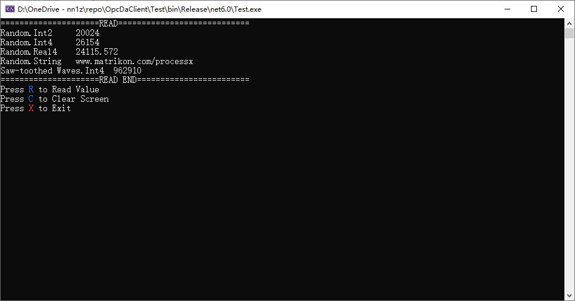

## 项目结构
解决方案中包含两个项目：Test和OpcDaClient。
Test是一个基本的例子，OpcDaClient是opc读取的类库。该类库主体上是基于西门子OPC例子做的，但是做了很多的改动：
1. 将西门子的例子改为了类库形。
2. 实现了订阅、异步读取、异步写入的事件。
3. 用manger类管理数据，用this索引器查询数据。
4. 本类库可以编译为64位，避免了因为一个类库导致整个项目不能以64位运行的问题。 **VERY IMPORTANT ：如果想在64位模式运行，需要安装opc 64位运行库** 
## 配置文件
工程中默认已经包含了一个opc.json。Manager类启动时会读取opc.json并以此配置文件的内容启动opcserver、创建opc组、创建opc item。
配置文件对应的类为OpcClient.Db.Config类，想了解配置文件的格式，查看OpcClient.Db.Config类即可。

### 数据类型定义

        public enum OpcDataType:short
        {
            Boolean =11,
            Byte =17,
            Short=2,
            Word=18,
            Int =3,
            UInt =19,
            Float=4,
            Double=5,
            Long=20,
            String=8
        }

## opc客户端开发技术
.net平台下做opc客户端的开发，大体有三种方法:
1. 使用OpcAutomation接口，网上可以下载到dll文件。但是自动化接口并不是opc规范必须实现的接口，某些opc server可能没有实现。用自动化接口的好处是简单。网络上很多基于自动化接口开发的opc客户端例子可参考。
2. 使用opc自定义接口。该接口难度比较高，如果用c++开发难度会更高。好处是通用，所有的opc server都支持此接口。开发所需要的接口定义文件是开源的(MIT)。
3. 使用opcNetApi。NetApi只有opc基金会的会员能**合法**拿到。当然，网络上有不少泄露的。使用该接口也非常简单。但是**在.Net Core以后的.net平台上无法运行**。原因有多个，其中一个是filetime问题，我尝试修复过，能改好。另一个是订阅等事件不能正常响应的问题，没有定位到问题在哪。

其实，还有一种方式，就是调用第三方的opc库，但是大都是收费的。因此，在.net core以后的.net平台(本项用用用.net6)想做classical opc开发考虑到经济性只能用opcAutomation和自定义接口了。自动化接口有什么法律风险，没有仔细研究过。但是有不少厂家提供免费的自动化接口dll，比如西门子。WinCC软件中西门子的opc da server都是免费的。

很多基于自定义接口开发的opc客户端，使用了opc基金会提供的老的OpcRcw文件。这些老的文件大都是32位的，这也是为什么很多opc客户端都只能32位运行的原因。如果有耐心反编译后再逐个修改也是可行的。实际上opc基金会提供了MIT协议的接口定义文件能支持64位，在opc基金会的代码仓库中能翻到，使用这些定义文件能解决64位问题。
### 运行截图

## License
部分代码来自于OPC基金会基于MIT协议开源的代码。本仓使用MIT协议发布。
